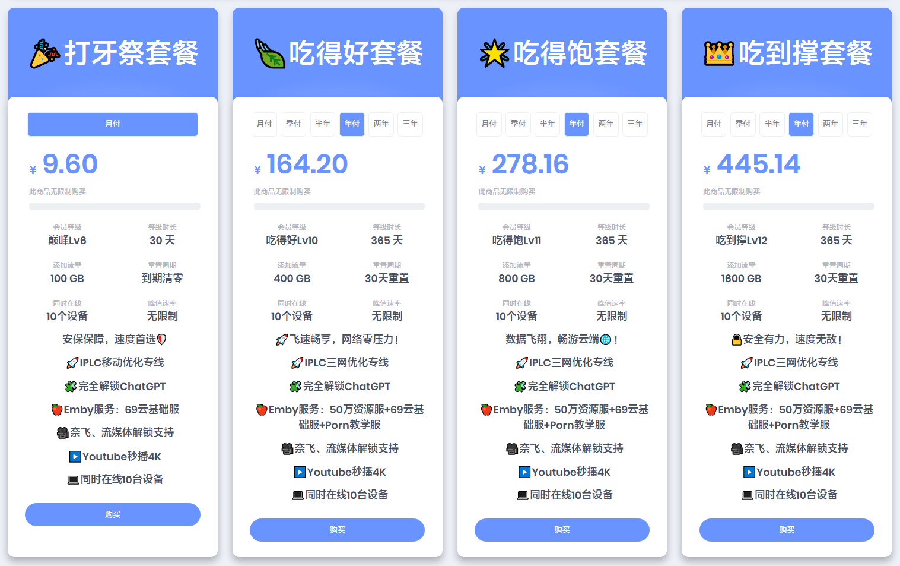

# 69yun官网最新地址

永久官网：[69yun69.com](https://china.69yun69.com/auth/register?code=lRxma2)

国内直连：[https://china.69yun69.com](https://china.69yun69.com/auth/register?code=lRxma2)

## 69云介绍

69云(69yun)成立于2022年6月，专注于提供高速稳定网络加速服务。全平台支持 SS 与 VMESS 协议，套餐性价比高，高质量节点，支持负载均衡，提供双千兆带宽加速，油管 4K 视频播放无压力，无论是网页浏览还是移动端使用，都能保持流畅体验。

全流媒体解锁，Netflix、Disney+、HBO、YouTube 等国际流媒体平台均可轻松访问。支持 ChatGPT Web 与 App 双端解锁，让用户在 AI 办公、娱乐与学习中畅通无阻。

## 69云(69yun)套餐价格

低至￥9.6元/月，每月100G。年付套餐性价比更高。

---

**温馨提示：任何服务均有跑路风险，请自行注意防范！**

**本页面仅分享网络信息，不做推荐，有问题请自行联系服务商处理！**

---
